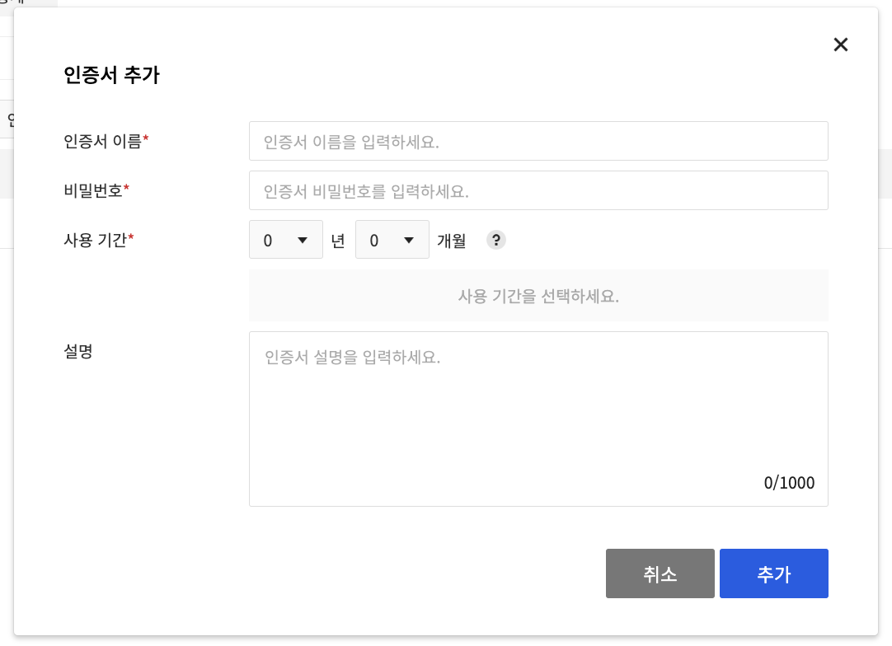

# SecureKeyManager

## 사용 이유
- 데이터베이스나 레디스 등의 접속 정보를 코드 상에 하드 코딩한다면 소스코드가 공개되어 있을 때 모든 정보가 오픈된다.
- SecureKeyManager로 기밀 데이터를 cloud 상에 암호화하여 보관하면 안전하다.

## 사용 예시 (NHN Cloud Console)

### 좌측 security -> Secure Key Manager 선택


<hr/>

### \+ 버튼 클릭하여 키 저장소 생성
### 이름 : 키 저장소 이름
### 설명 : 키 저장소에 대한 설명
### 인증 방법 : 클라이언트 인증서 선택 (키저장소에 접근할 때 쓰임)


<hr/>

### 인증서 추가
### * 비밀번호는 반드시 기억해야 함
### 생성한 키(*.p12)는 다운로드하기
키 값 보는 명령어
```
openssl pkcs12 -in inkBridge.p12 -nodes
```
인증서 추가할 때 등록한 비밀번호 입력해야 private key 확인 가능


<hr/>

#### 보안이 필요한 정보들을 관리


<hr/>

#### 키를 등록한 상태
#### 부여받은 아이디는 실제 정보 대신해서 쓰임


### Code

#### 응답 Dto class
```java
@Getter
public class KeyResponseDto {
    private Header header;
    private Body body;

    @Getter
    @NoArgsConstructor
    public static class Body {
        private String secret;
    }
 
    @Getter
    @NoArgsConstructor
    public static class Header {
        private Integer resultCode;
        private String resultMessage;
        private boolean isSuccessful;
    }
}
```

```java
public String keyStore(String keyId) {
    try {
        KeyStore clientStore = KeyStore.getInstance("PKCS12");  // PKCS12형식의 키 저장소를 가져온다
        InputStream result = new ClassPathResource("inkBridge.p12").getInputStream(); // 클래스 경로에 있는 inkBridge.p12 파일 읽기, 인증서와 개인키를 포함
        clientStore.load(result, password.toCharArray()); // 키스토어에 인증서와 개인키를 로드

        SSLContext sslContext = SSLContextBuilder.create()  // SSL 통신 설정
                .setProtocol("TLS")
                .loadKeyMaterial(clientStore, password.toCharArray())
                .loadTrustMaterial(new TrustSelfSignedStrategy())
                .build();

        SSLConnectionSocketFactory sslConnectionSocketFactory = // SSL 소켓 팩토리 생성
                new SSLConnectionSocketFactory(sslContext);
        CloseableHttpClient httpClient = HttpClients.custom()   //  SSL 소켓 팩토리로  HTTP 클라이언트 생성
                .setSSLSocketFactory(sslConnectionSocketFactory)
                .build();

        HttpComponentsClientHttpRequestFactory requestFactory =    // HTTP 클라이언트로 HTTP 요청 팩토리 생성
                new HttpComponentsClientHttpRequestFactory(httpClient);

        HttpHeaders headers = new HttpHeaders();
        headers.setContentType(MediaType.APPLICATION_JSON);
        headers.setAccept(List.of(MediaType.APPLICATION_JSON));

        RestTemplate restTemplate = new RestTemplate(requestFactory);

        URI uri = UriComponentsBuilder
                .fromUriString(url)
                .path(path)
                .encode()
                .build()
                .expand(appKey, keyId)
                .toUri();
        return Objects.requireNonNull(restTemplate.exchange(uri,
                                HttpMethod.GET,
                                new HttpEntity<>(headers),
                                KeyResponseDto.class)
                        .getBody())
                .getBody()
                .getSecret();
    } catch (KeyStoreException | IOException | CertificateException
             | NoSuchAlgorithmException
             | UnrecoverableKeyException
             | KeyManagementException e) {
        throw new KeyMangerException(e.getMessage());
    }
}
```

### 실제 사용 예시
```java
// 코드 최적화 생각해보기
@ConstructorBinding
@RequiredArgsConstructor
@ConfigurationProperties(prefix = "secure-key-manager")
public class KeyConfig {

    private final String password;
    private final String url;
    private final String path;
    private final String appKey;

    public String keyStore(String keyId) {
        try {
            KeyStore clientStore = KeyStore.getInstance("PKCS12");
            InputStream result = new ClassPathResource("inkBridge.p12").getInputStream();
            clientStore.load(result, password.toCharArray());

            SSLContext sslContext = SSLContextBuilder.create()
                .setProtocol("TLS")
                .loadKeyMaterial(clientStore, password.toCharArray())
                .loadTrustMaterial(new TrustSelfSignedStrategy())
                .build();

            SSLConnectionSocketFactory sslConnectionSocketFactory =
                new SSLConnectionSocketFactory(sslContext);
            CloseableHttpClient httpClient = HttpClients.custom()
                .setSSLSocketFactory(sslConnectionSocketFactory)
                .build();

            HttpComponentsClientHttpRequestFactory requestFactory =
                new HttpComponentsClientHttpRequestFactory(httpClient);

            HttpHeaders headers = new HttpHeaders();
            headers.setContentType(MediaType.APPLICATION_JSON);
            headers.setAccept(List.of(MediaType.APPLICATION_JSON));

            RestTemplate restTemplate = new RestTemplate(requestFactory);

            URI uri = UriComponentsBuilder
                .fromUriString(url)
                .path(path)
                .encode()
                .build()
                .expand(appKey, keyId)
                .toUri();
            return Objects.requireNonNull(restTemplate.exchange(uri,
                        HttpMethod.GET,
                        new HttpEntity<>(headers),
                        KeyResponseDto.class)
                    .getBody())
                .getBody()
                .getSecret();
        } catch (KeyStoreException | IOException | CertificateException
                 | NoSuchAlgorithmException
                 | UnrecoverableKeyException
                 | KeyManagementException e) {
            throw new KeyManagerException(e.getMessage());
        }
    }
}
```

```properties
# mysql
spring.datasource.username=1d2ba69220434fc3adfd3674c614d94a //키 추가 하면서 받은 아이디를 입력
spring.datasource.password=619e3249eb3e45368aab00cee75f61d7

# key manager
secure-key-manager.password=secureInkBridge
secure-key-manager.url=https://api-keymanager.nhncloudservice.com
secure-key-manager.path=/keymanager/v1.0/appkey/{appkey}/secrets/{keyid}
secure-key-manager.appKey=CuKPvJQR7enquqrZ
```

```java
@Configuration
@AllArgsConstructor
public class JpaConfig {

    private JpaProperty jpaProperty;
    private KeyConfig keyConfig;
    @Bean
    public DataSource getDataSource() {
        BasicDataSource dataSource = new BasicDataSource();

        dataSource.setUrl(keyConfig.keyStore(jpaProperty.getUrl()));
        dataSource.setUsername(keyConfig.keyStore(jpaProperty.getUsername()));
        dataSource.setPassword(keyConfig.keyStore(jpaProperty.getPassword()));

        dataSource.setInitialSize(20);
        dataSource.setMaxIdle(20);
        dataSource.setMinIdle(20);
        dataSource.setMaxTotal(20);

        dataSource.setMaxWaitMillis(20);

        dataSource.setTestOnBorrow(true);
        dataSource.setTestOnReturn(true);
        dataSource.setTestWhileIdle(true);

        return dataSource;
    }
}
```


## Reference
[NHN Cloud Document - Security](https://docs.nhncloud.com/ko/Security/Secure%20Key%20Manager/ko/overview/)