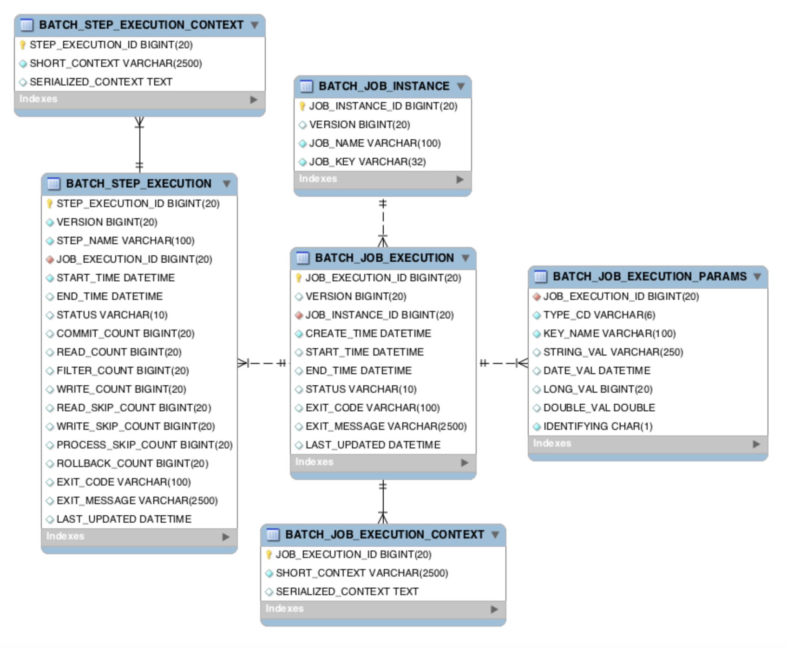
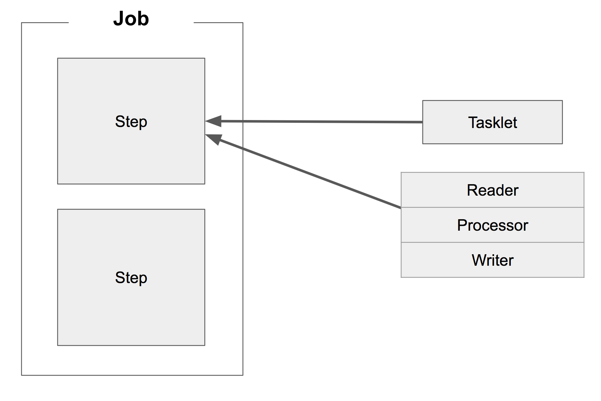

# SpringBatch

## 1. 배치란?

> 배치(Batch)는 **일괄처리**
> 

만약 우리가 **매일 전 날의 데이터를 집계처리**하는 기능을 만든다면? 
해당서버는 **기능을 처리하는데 많은 자원을 소모**하며 다른 **Request를 처리하지 못할가능성이 높이진다**.

이러한 문제도 있지만 과연 하루에 1번을 수행하기위해 API를 구성하는것은 괜찮을까?

보통의 경우는 좋은 선택이 아니다.(ex 불필요한 네트워크 오버헤드, 보안 및 인증 등.)
심지어 이미 실행중인데 다른 누군가가 실행한다면?

따라서 이러한 단발성 데이터를 처리하는 애플리케이션인 배치 애플리케이션이 필요하다.

<aside>
💡

- 대용량 데이터 - 배치 어플리케이션은 대량의 데이터를 가져오거나, 전달하거나, 계산하는 등의 처리를 할 수 있어야 합니다.
- 자동화 - 배치 어플리케이션은 심각한 문제 해결을 제외하고는 **사용자 개입 없이 실행**되어야 합니다.
- 견고성 - 배치 어플리케이션은 잘못된 데이터를 충돌/중단 없이 처리할 수 있어야 합니다.
- 신뢰성 - 배치 어플리케이션은 무엇이 잘못되었는지를 추적할 수 있어야 합니다. (로깅, 알림)
- 성능 - 배치 어플리케이션은 **지정한 시간 안에 처리를 완료**하거나 동시에 실행되는 **다른 어플리케이션을 방해하지 않도록 수행**되어야합니다.
</aside>

## 2. Batch vs Quartz?

> **Quartz는 스케줄러의 역할**이지,
Batch 와 같이 **대용량 데이터 배치 처리에 대한 기능을 지원하지 않습니다.**
> 
> 
> 
> 반대로 Batch 역시 Quartz의 다양한 스케줄 기능을 지원하지 않아서 보통은 Quartz + Batch를 조합해서 사용합니다.
> 다만 InkBridge프로젝트는 Batch만 사용예정
> 

## 3. 필요한 의존성

> 가장중요한 스프링 배치과 웹을 필두로 mysql,h2,jpa등이 필요하다. api서버와 batch서버를 분리하여 사용함으로써 DB까지 분리하여 사용하는게 MSA아키텍처에는 제일 적합하다. 하지만 여러 사유로 DB를 하나로 사용하는경우도 있다고 한다.
> 

## 4. 배치 프로젝트 시작


> **스프링 배치 아키텍쳐**
> 

애플리케이션 : 개발자가 작성한 모든 배치작업과 사용자 정의 코드.

배치코어 : 배치작업을 시작하고 제어하는데 필요한 핵심 클래스, JobLauncher, Job 그리고 Step이 포함되어있다.

배치 인프라스트럭쳐:  기본적으로 애플리케이션이랑 배치코어는 배치 인프라스트척쳐 위에 올라간다. 이 인프라에는 애플리케이션 개발자( 및 와 같은 판독기 와 기록기 )와 핵심 프레임워크 자체(자체 라이브러리인 재시도)가 `RetryTemplate`모두 사용하는 공통 판독기, 기록기 및 서비스가 포함(`ItemReade rItemWriter`)

### 소스코드

### 코드 1

```java
@SpringBootApplication
@EnableBatchProcessing //배치기능 활성화
public class BatchApplication {

	public static void main(String[] args) {
		SpringApplication.run(BatchApplication.class, args);
	}

}
```

---

```java
spring.batch.jdbc.initialize-schema=always
```



메타 테이블이 궁금하다면?
https://jojoldu.tistory.com/326

### 코드 2

```java
@Slf4j // log 사용을 위한 lombok 어노테이션
@RequiredArgsConstructor // 생성자 DI를 위한 lombok 어노테이션
@Configuration
public class SimpleJobConfiguration {
    private final JobBuilderFactory jobBuilderFactory; // 생성자 DI 받음
    private final StepBuilderFactory stepBuilderFactory; // 생성자 DI 받음

    @Bean
    public Job simpleJob() {
        return jobBuilderFactory.get("simpleJob")
                .start(simpleStep1())
                .build();
    }

    @Bean
    public Step simpleStep1() {
        return stepBuilderFactory.get("simpleStep1")
                .tasklet((contribution, chunkContext) -> {
                    log.info(">>>>> This is Step1");
                    return RepeatStatus.FINISHED;
                })
                .build();
    }
}
```




그림과 같이 스텝에는 두종류가 있다 바로 TaskLet과 Reader,Procerssor,Writer묶음이다.

당연히 rader procerssor후에 tasklet을 마무리를 하지못한다.    

```java
public class StepNextConditionalJobConfiguration {

    private final JobBuilderFactory jobBuilderFactory;
    private final StepBuilderFactory stepBuilderFactory;

    @Bean
    public Job stepNextConditionalJob() {
        return jobBuilderFactory.get("stepNextConditionalJob")
                .start(conditionalJobStep1())
                    .on("FAILED") // FAILED 일 경우
                    .to(conditionalJobStep3()) // step3으로 이동한다.
                    .on("*") // step3의 결과 관계 없이 
                    .end() // step3으로 이동하면 Flow가 종료한다.
                .from(conditionalJobStep1()) // step1로부터
                    .on("*") // FAILED 외에 모든 경우
                    .to(conditionalJobStep2()) // step2로 이동한다.
                    .next(conditionalJobStep3()) // step2가 정상 종료되면 step3으로 이동한다.
                    .on("*") // step3의 결과 관계 없이 
                    .end() // step3으로 이동하면 Flow가 종료한다.
                .end() // Job 종료
                .build();
    }

    @Bean
    public Step conditionalJobStep1() {
        return stepBuilderFactory.get("step1")
                .tasklet((contribution, chunkContext) -> {
                    log.info(">>>>> This is stepNextConditionalJob Step1");

                    /**
                        ExitStatus를 FAILED로 지정한다.
                        해당 status를 보고 flow가 진행된다.
                    **/
                    contribution.setExitStatus(ExitStatus.FAILED);

                    return RepeatStatus.FINISHED;
                })
                .build();
    }
    /**
	    step2,3생략
    **/
}
```

## Chunk란?

Spring Batch에서의 Chunk란 데이터 덩어리로 작업 할 때

**각 커밋 사이에 처리되는 row 수**

를 얘기합니다.

즉, Chunk 지향 처리란

**한 번에 하나씩 데이터를 읽어 Chunk라는 덩어리를 만든 뒤, Chunk 단위로 트랜잭션**

을 다루는 것을 의미합니다.

한마디로 트랜잭션처럼 오류가나면 되돌아가게되는데. 이때 청크단위로 되돌아가게된다.

## ItemReader

무언가로부터 데이터를 읽어오는것.

InkBridge프로젝트에서는 DB값을 읽어오는데 사용됫지만

결국 데이터소스들을 처리하기 위한것들이라 File, Xml, Json등 여러형태의 데이터들을 읽을수있다.

ItemReader의 종류는  Cusor기반과 Paging기반이있는데 InkBridge프로젝트는 Paging기반 중 JpaPagingItemReader를 사용할것이다

- Cursor 기반 ItemReader 구현체
    - JdbcCursorItemReader
    - HibernateCursorItemReader
    - StoredProcedureItemReader
- Paging 기반 ItemReader 구현체
    - JdbcPagingItemReader
    - HibernatePagingItemReader
    - JpaPagingItemReader
    

## ItemWriter

아이템을 저장하는데 사용. 우리는 JpaItemWriter를 사용하기 때문에 Enitity클래스로 바로 처리가 가능하다.

영속성관리를 위해 엔티티 매니저를 추가해줘야한다.

## ItemProcessor

아이템을 처리하는데 사용. (필터, 변환 등)

```java
ItemProcessor<InItem,OutItem> processor 형식으로 저장한다.
```

이제 실제 InkBirdge에 사용된 배치코드들을 보며 마무리하겠다.

```java
@Configuration
@EnableBatchProcessing
@EnableScheduling
@Slf4j
public class BirthdayCouponJobConfig {

    private final JobBuilderFactory jobBuilderFactory;
    private final StepBuilderFactory stepBuilderFactory;
    private final EntityManagerFactory entityManagerFactory;
    private final JobLauncher jobLauncher;
    @PersistenceContext
    private final EntityManager entityManager;
    private static final int chunkSize = 10;

    public BirthdayCouponJobConfig(JobBuilderFactory jobBuilderFactory,
        StepBuilderFactory stepBuilderFactory, EntityManagerFactory entityManagerFactory,
        JobLauncher jobLauncher, EntityManager entityManager) {
        this.jobBuilderFactory = jobBuilderFactory;
        this.stepBuilderFactory = stepBuilderFactory;
        this.entityManagerFactory = entityManagerFactory;
        this.jobLauncher = jobLauncher;
        this.entityManager = entityManager;
    }

    @Bean
    public Job birthdayCouponJob() {
        return jobBuilderFactory.get("birthdayCouponJob")
            .incrementer(new RunIdIncrementer())
            .start(birthdayCreateStep())
            .next(birthdayCouponIssueStep())
            .build();
    }

    @Bean
    public Step birthdayCreateStep() {
        return stepBuilderFactory.get("birthdayCreateStep")
            .tasklet((contribution, chunkContext) -> {
                LocalDate now = LocalDate.now();
                Long count = entityManager.createQuery(
                        "SELECT COUNT(c) FROM Coupon c WHERE MONTH(c.basicIssuedDate) = :month AND YEAR(c.basicIssuedDate) = :year AND c.isBirth = true",
                        Long.class)
                    .setParameter("month", now.getMonthValue())
                    .setParameter("year", now.getYear())
                    .getSingleResult();
                log.info("생일쿠폰 갯수 : " + count);
                if (count > 0) {
                    log.info("Coupons for the current month already exist. Skipping creation.");
                    return RepeatStatus.FINISHED;
                } else {
                    // 중복된 쿠폰이 없을 경우에만 아래 쿠폰 생성 로직 실행
                    Coupon coupon = Coupon.createBirthdayCoupon(now);
                    log.info(coupon.toString());
                    entityManager.persist(coupon);
                    return RepeatStatus.FINISHED;
                }
            })
            .build();
    }
    @Bean
    public Step birthdayCouponIssueStep() {
        return stepBuilderFactory.get("birthdayCouponIssueStep")
            .<Member, MemberCoupon>chunk(chunkSize)
            .reader(memberLoad())
            .processor(issue())
            .writer(birthdayCouponWriter())
            .build();
    }
    @Bean
    public JpaPagingItemReader<Member> memberLoad() {
        return new JpaPagingItemReaderBuilder<Member>()
            .name("memberLoad")
            .entityManagerFactory(entityManagerFactory)
            .pageSize(chunkSize)
            .queryString("SELECT m FROM Member m WHERE MONTH(m.birthday) = MONTH(:today)")
            .parameterValues(Collections.singletonMap("today", LocalDate.now()))
            .build();
    }
    @Bean
    public ItemProcessor<Member, MemberCoupon> issue() {
        return member -> {
                // 쿠폰 발급 로직 구현
            String couponId = entityManager.createQuery(
                    "SELECT c.couponId FROM Coupon c WHERE MONTH(c.basicIssuedDate) = :month AND YEAR(c.basicIssuedDate) = :year AND c.isBirth = true",
                    String.class)
                .setParameter("month", LocalDate.now().getMonthValue())
                .setParameter("year", LocalDate.now().getYear())
                .getSingleResult();
            // 이미 발급된 쿠폰인지 확인
            boolean couponAlreadyIssued = entityManager.createQuery(
                    "SELECT COUNT(mc) FROM MemberCoupon mc WHERE mc.memberId = :memberId AND mc.couponId = :couponId",
                    Long.class)
                .setParameter("memberId", member.getMemberId())
                .setParameter("couponId",couponId)
                .getSingleResult() > 0;

            if (couponAlreadyIssued) {
                // 이미 쿠폰을 발급받은 경우, null을 반환하여 해당 회원을 건너뜁니다.
                return null;
            }
            return MemberCoupon.issueMemberCoupon(couponId, member.getMemberId());
        };
    }
    @Bean
    public ItemWriter<MemberCoupon> birthdayCouponWriter() {
        return memberCoupons -> {
            // 쿠폰을 저장하는 로직 구현
            for (MemberCoupon memberCoupon : memberCoupons) {
                entityManager.persist(memberCoupon);
                log.info("MemberCoupon saved: {}", memberCoupon);
            }
        };
    }

    @Scheduled(cron = "0 0 0 1 * *")
    public void schedule()
        throws JobInstanceAlreadyCompleteException, JobExecutionAlreadyRunningException, JobRestartException, JobParametersInvalidException {
        JobParameters jobParameters = new JobParametersBuilder()
            .addLong("time", System.currentTimeMillis()) // 현재 시간을 이용하여 고유한 JobParameter 생성
            .toJobParameters();

        jobLauncher.run(birthdayCouponJob(), jobParameters);
    }
}
```

다음중 개선이 필요한 코드는 writer이다 현재 영속성을 가지고있음에도 불구하고 청크단위가 10일때 17개의 데이터가 들어온다면 7개의 데이터가 처리가되지않는다. 그래서 writer에서 강제적으로 entity매니저를 통해 저장시켜줫는데 좋지못한방법이라 생각한다.

참고 : https://jojoldu.tistory.com/
