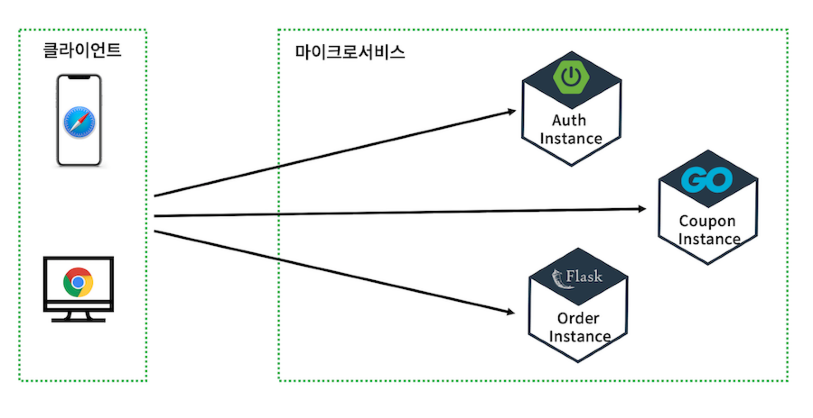
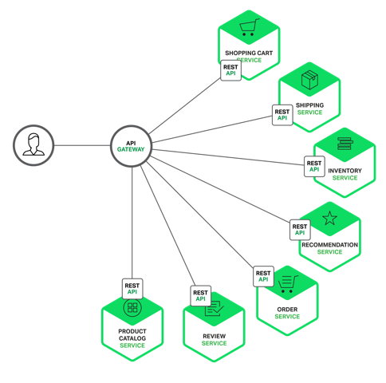
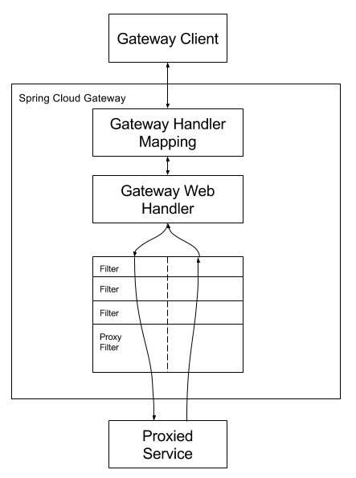
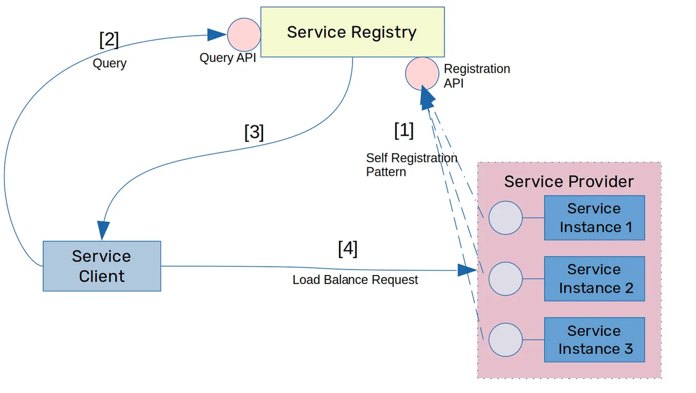

= API Gateway

* API 호출과 관련된 모든 작업을 편리하게 실행할 수 있게 하는 서비스.
* API 서버 앞에서 모든 API 서버들의 Endpoint를 묶어 API에 대한 인증, 인가, 메세지에 따른 서버로 라우팅하는 기능 담당.

== Gateway가 없다면

* 클라이언트에서 각각 주문에 대한 호스트네임(혹은 IP)를 알아야하며 호출해야 한다.

== API Gateway Patten

* 클라이언트의 모든 요청은 Gateway를 거친다.
* API 서버 앞에서 단일 진입점을 제공.

=== 장점

* 애플리케이션의 내부 구조를 캡슐화 한다.
** 클라이언트는 특정 서비스를 호출하지 않고 Gateway와 통신.

=== 단점

== Spring Cloud Gateway

=== 작동 방식

1. Client가 Spring Cloud Gateway에 요청.
2. Gateway Handler Mapping이 조건에 일치하면 Gateway Web Handler로 보냄.
3. Gateway Web Handler는 요청과 관련된 Filter들을 FilerChain을 통해 요청을 처리.
** proxied service로 요청을 보내기 전/후로 로직을 실행.

=== 구성

* Route
** ID, URI, Predicate, Filter로 구성.
** Gateway로 요청된 URI 조건이 일치할 경우 맵핑된 uri로 전송.
* Predicate
** 조건이 만족하는지 확인.
* Filter
** 요청과 응답에 대해 처리.

[source,xml]
----
<project>
  <properties>
    <spring-cloud.version>2021.0.8</spring-cloud.version>
  </properties>

  <dependencies>
    <dependency>
      <groupId>org.springframework.cloud</groupId>
      <artifactId>spring-cloud-starter-gateway</artifactId>
    </dependency>
  </dependencies>

  <dependencyManagement>
    <dependencies>
      <dependency>
        <groupId>org.springframework.cloud</groupId>
        <artifactId>spring-cloud-dependencies</artifactId>
        <version>${spring-cloud.version}</version>
        <type>pom</type>
        <scope>import</scope>
      </dependency>
    </dependencies>
  </dependencyManagement>
</project>
----

[source,java]
----
@Configuration
public class GatewayConfig {

    @Bean
    public RouteLocator gatewayRoutes(RouteLocatorBuilder builder) {
        return builder.routes()
            .route("auth", r -> r.path("/auth/**")
                .uri("http://localhost:8080"))
            .build();
    }
}

----

== Spring Cloud Netflix

* MSA 환경에서 Service의 Ip, Port 정보가 일정하지 않고 지속적으로 변화할 수 있음.
* 기존 Gateway의 설정에 각 서비스의 ip, port가 그대로 적힌다.
** Service의 정보가 변경된다면 Gateway도 변경되어야 하는 의존성이 생김.

=== Service Discovery Pattern

* 서비스를 등록하고 등록된 서비스의 목록을 반환한다.
* health check(actuator)를 통해 현재 서비스가 가능한 서비스를 판별, 서비스가 가능한 목록 제공.
* 서비스 간 부하 분산 비율 조정.

==== Client side Discovery

* Service client가 Service registry에서 서비스의 위치를 찾아 호출하는 방식
** Spring Cloud Gateway는 Service Registry(Netflix Eureka)에서 일정 시간마다 서비스의 위치, 상태를 제공받아 해당 서비스를 호출한다.

==== Server side Discovery

* proxy server를 제공하고, proxy server를 호출하면 Service Registry로 부터 등록된 서비스의 위치를 기반으로 라우팅하는 방식

==== Service Registry
* Service Discovery를 하기 위한 역할
* 사용 가능한 서비스 인스턴스의 목록을 관리
* 서비스 등록, 해제, 조회 API 제공
* Netflix Eureka

**Eureka Server**
[source, java]
----
@EnableEurekaServer
@SpringBootApplication
public class EurekaApplication {

    public static void main(String[] args) {
        SpringApplication.run(EurekaApplication.class, args);
    }

}

----

**Eureka Client**
[source, java]
----
@EnableEurekaClient
@SpringBootApplication
public class BackendApplication {

    public static void main(String[] args) {
        SpringApplication.run(BackendApplication.class, args);
    }

}

----

[source, properties]
----
spring.application.name=(Eureka Server에 등록할 Service 이름)
# 대, 소문자를 구별하지 않고 모두 대문자로 등록됨

# Server가 종료되었을 때 종료 방식
server.shutdown=graceful
spring.lifecycle.timeout-per-shutdown-phase=30s

# eureka에 등록된 인스턴스의 목록을 주기적으로 가져올지 여부
eureka.client.fetch-registry=true
# eureka 서버에 인스턴스로 등록할지 여부
eureka.client.register-with-eureka=true

# actuator 설정
management.endpoint.health.status.order=DOWN, UP
management.endpoint.shutdown.enabled=true
management.endpoints.web.exposure.include=health, info
management.info.env.enabled=true

backend.name=backend

# Service Registry에 Client 본인을 등록.
eureka.client.service-url.defaultZone=http://(eurekaIP):(eurekaPort)/eureka

eureka.instance.instance-id=backend

eureka.instance.hostname=133.186.132.145

----

'''
참고 자료 +
link:https://medium.com/cloud-native-daily/microservices-patterns-part-03-service-discovery-patterns-97d603b9a510[]
link:https://github.com/nhnacademy-bootcamp/project-spring-cloud/tree/main[]