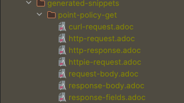
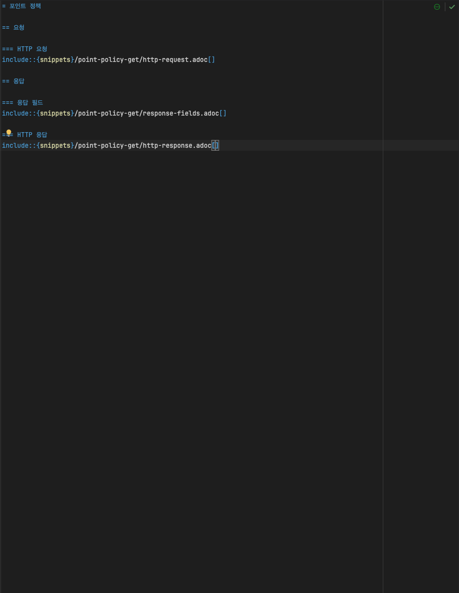
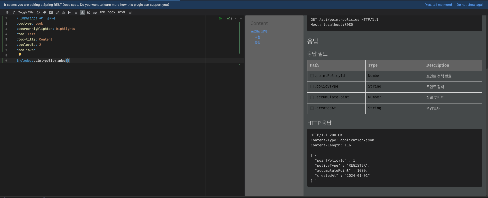
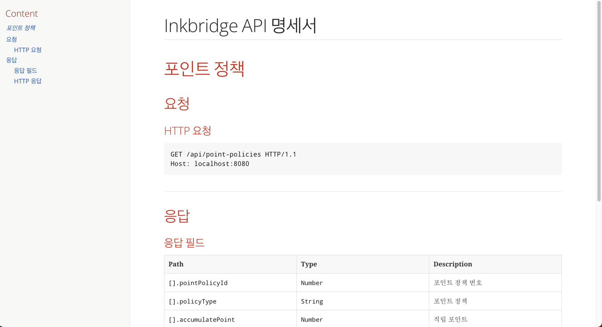

= Spring REST Docs

Spring MVC Test, WebTestClient로 자동 생성된 스니펫과 직접 작성한 문서를 결합해 RESTful 서비스를 문서화 한다.

* Spring REST Docs는 Asciidoctor를 사용한다.
  * 일반 텍스트를 처리하고 필요에 맞게 스타일과 레이아웃을 갖춘 HTML 을 생성.

* RESTful 서비스를 문서화 하는 것은 주로 해당 리소스를 설명하는 것.
  * 리소스가 사용하는 HTTP 요청과 생성되는 HTTP 응답의 세부정보.

== 사용법

=== 1. 테스트 설정
[source, java]
----
@AutoConfigureRestDocs
@ExtendWith({RestDocumentationExtension.class, MockitoExtension.class})
public class ExamTest {
    
}
----

=== 2. REST API 호출
[source, java]
----

/**
 * class: PointPolicyControllerTest.
 *
 * @author jangjaehun
 * @version 2024/02/16
 */
@AutoConfigureRestDocs
@WebMvcTest(PointPolicyController.class)
@ExtendWith({RestDocumentationExtension.class, MockitoExtension.class})
class PointPolicyControllerTest {

    @Autowired
    MockMvc mockMvc;

    @MockBean
    PointPolicyService pointPolicyService;

    @Test
    @DisplayName("포인트 정책 전체 조회 테스트")
    void testGetPointPolicies() {
        PointPolicyReadResponseDto responseDto = new PointPolicyReadResponseDto(1L, "REGISTER",
            1000L, LocalDate.of(2024, 1, 1));

        List<PointPolicyReadResponseDto> list = new ArrayList<>();
        list.add(responseDto);

        given(pointPolicyService.getPointPolicies()).willReturn(list);

        mockMvc.perform(get("/api/point-policies"))
            .andExpect(status().isOk())
            .andExpect(content().contentType(MediaType.APPLICATION_JSON))
            .andExpect(jsonPath("$[0].pointPolicyId", equalTo(1)))
            .andExpect(jsonPath("$[0].policyType", equalTo("REGISTER")))
            .andExpect(jsonPath("$[0].accumulatePoint", equalTo(1000)))
            .andExpect(jsonPath("$[0].createdAt", equalTo("2024-01-01")))
            .andDo(document("point-policy-get", // snippet이 저장될 경로
                preprocessRequest(prettyPrint()),
                preprocessResponse(prettyPrint()), // json body 정렬해서 결과 나오게
                responseFields(
                    fieldWithPath("[].pointPolicyId").description("포인트 정책 번호"),
                    fieldWithPath("[].policyType").description("포인트 정책"),
                    fieldWithPath("[].accumulatePoint").description("적립 포인트"),
                    fieldWithPath("[].createdAt").description("변경일자")
                )));
    }
}
----

* target/generated-snippets 디렉토리 하위에 테스트 코드에서 지정한 경로로 디렉토리 생성
** `<output-directory>/index/curl-request.adoc`
** `<output-directory>/index/http-request.adoc`
** `<output-directory>/index/http-response.adoc`
** `<output-directory>/index/httpie-request.adoc`
** `<output-directory>/index/request-body.adoc`
** `<output-directory>/index/response-body.adoc`

=== 3. 스니펫 사용

image:images/use-snippets.png[]

* `src/main/asciidoc/*.adoc` 파일 생성
* `include::{snippets}/point-policy-get/response-body.adoc[]`

==== index.adoc 파일에 include

==== mvn package 후 target/generated-docs 경로에 html 문서 생성 확인 (문서 생성 경로 수정 가능)

'''
*참고 글*

* link:https://docs.spring.io/spring-restdocs/docs/current/reference/htmlsingle/#working-with-asciidoctor[]