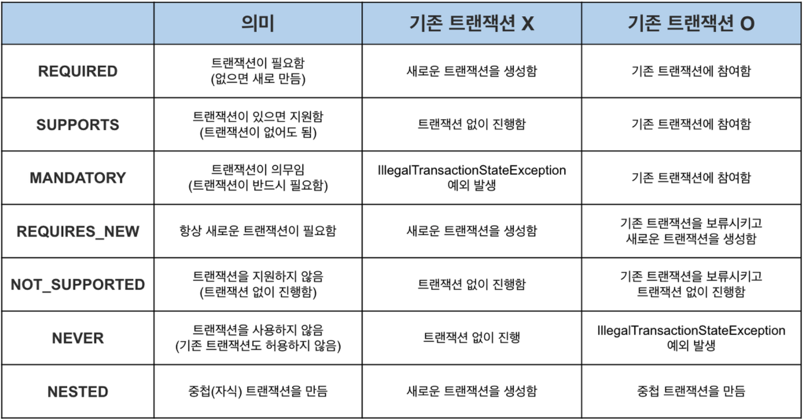

= @Transactional

* 데이터베이스의 트랜잭션을 메소드 단위로 묶을 때 사용할 수 있습니다.
* @Transactional 어노테이션을 사용 해 전파, isolation, timeout, readOnly flag, rollback role 등을 설정할 수 있습니다.

== 사용 법
* 인터페이스, 클래스, 메소드 등에 어노테이션을 사용할 수 있습니다.
* 트랜잭션은 우선순위에 따라 오버라이드 됩니다.
** 만일 클래스에 어노테이션이 붙은 경우 해당 클래스의 모든 public 메소드에 적용됩니다.
*** private, protected 메소드에 어노테이션을 붙인다면 스프링은 해당 어노테이션을 무시합니다.

=== 전파 - Propagation

* 한번에 처리되어야할 비즈니스 로직의 트랜잭션 범위를 뜻합니다.
* 해당 속성 값에 따라 기존 트랜잭션에서 새로운 트랜잭션을 생성할지 기존 트랜잭션에 합류할 지를 결정합니다.

==== REQUIRED
* 기본 설정 값 입니다.
* 시작된 기존의 트랜잭션이 있을 경우 해당 트랜잭션에 포함됩니다.
* 시작된 트랜잭션이 없을 경우 새로운 트랜잭션을 시작합니다.

==== REQUIRES_NEW
* 기존 트랜잭션이 존재한다면 잠시 보류 시킨 후 새로운 트랜잭션을 시작합니다.

==== SUPPORTS
* 기존 트랜잭션이 존재하면 해당 트랜잭션에 포함되며, 존재하지 않는다면 트랜잭션을 생성하지 않습니다.

==== MANDATORY
* 기존 트랜잭션이 존재하면 해당 트랜잭션에 포함되며, 존재하지 않는다면 에러를 발생시킵니다.

==== NEVER
* 기존 트랜잭션이 존재하면 에러를 발생시킵니다.

==== NOT_SUPPORTED
* 기존 트랜잭션이 존재하면 해당 트랜잭션을 중지시키고 해당 비즈니스 로직을 트랜잭션 없이 동작시킵니다.

==== NESTED
* 중첩된 트랜잭션은 먼저 시작된 부모 트랜잭션의 커밋과 롤백에는 영향을 받지만 자신의 커밋과 롤백은 부모 트랜잭션에게 영향을 주지 않습니다. +
메인 트랜잭션이 롤백되면 중첩된 로그 트랜잭션도 같이 롤백되지만, 반대로 중첩된 로그 트랜잭션이 롤백돼도 메인 작업에 이상이 없다면 메인 트랜잭션은 정상적으로 커밋된다.

